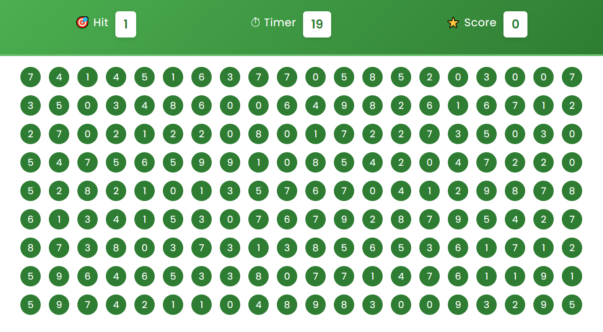

# 🫧 Bubble Game – JavaScript Practice Project

A fun and simple **bubble-clicking game** built using **HTML, CSS, and JavaScript**. This project was created purely as a **logic-building and DOM manipulation exercise** for frontend development practice.

---

## 🎮 How It Works

* A random number (0–9) is shown as the **target**.
* Click on matching bubbles as fast as you can before the **60-second timer** runs out.
* Each correct click gives you **+10 points** and resets the bubble grid with a new target.
* At the end of the timer, your **final score** is displayed with a **"Play Again"** button.

---

## 🚀 Live Demo

👉(https://umernadim.github.io/bubbleGame/)

---

## 🛠️ Tech Stack

* **HTML5** – Structure
* **CSS3** – Styling and layout
* **JavaScript (ES6)** – Game logic and DOM updates

---

## 📌 What I Practiced

* JavaScript logic building
* `setInterval()` and timers
* DOM manipulation
* Dynamic content creation with `innerHTML`
* Event delegation and conditionals

---

## 📂 Folder Structure

```
bubble-game/
│
├── index.html       # Game layout and structure
├── style.css        # All game styles and UI design
└── script.js        # Game logic and interactions
```

---

## 📷 Screenshot

### 🏠 Homepage Interface


---

## 📝 Notes

* This is a **practice project only** — it does not include scoring persistence, difficulty levels, or mobile responsiveness yet.
* Built to strengthen **JavaScript logic and UI building skills**.

---

## 📄 License

This project is open-source and free to use for **educational and personal development**.

---

## ✨ Author

Built with 💻 and ☕ by **\[Muhammad Umer]**
🔗 GitHub: [@umernadim](https://github.com/umernadim)
